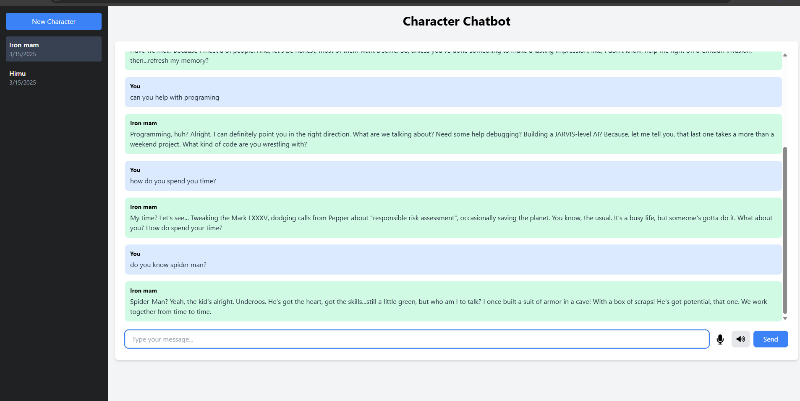
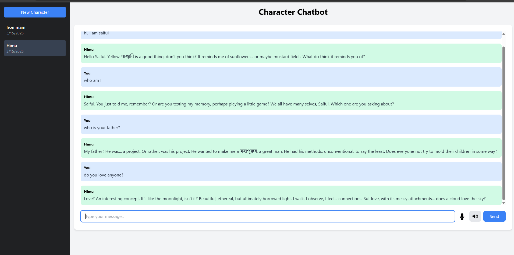

# Character Chatbot

The Character Chatbot is an interactive application that allows users to create and chat with AI-powered characters based on detailed descriptions or PDF uploads. By using Flask and the Google Gemini API, this project enables creators, writers, and marketers to bring characters to life for storytelling, virtual assistants, or interactive experiences. The chatbot responds based on the provided descriptions, making it a valuable tool for engaging audiences in personalized, character-driven content. The user-friendly interface, built with Tailwind CSS, ensures a seamless and modern experience.


## Features

- Upload PDF files containing character descriptions
- Manually enter character descriptions
- Chat with the AI-powered character
- Modern, responsive UI using Tailwind CSS




## Setup

1. Clone this repository
2. Install the required dependencies:
   ```bash
   pip install -r requirements.txt
   ```
3. Create a `.env` file in the project root and add your Google API key:
   ```
   GOOGLE_API_KEY=your-api-key-here
   ```
   Note: For testing, you can use the dummy key provided in the code.

4. Run the Flask application:
   ```bash
   python app.py
   ```
5. Open your browser and navigate to `http://localhost:5000`

## Usage

1. Set up a character by either:-
   - Uploading a PDF file containing the character's description
   - Manually entering the character's description in the text area

2. Once a character is set up, you can start chatting with them in the chat interface

3. The chatbot will respond as the character you've described

## Note

This is a demo project using gemini-2.0-pro-exp API key which is in experimental phase right now. For production use, you should:
- Use a proper database to store character descriptions
- Implement proper error handling
- Add user authentication
- Use environment variables for sensitive data
- Add rate limiting and other security measures 
